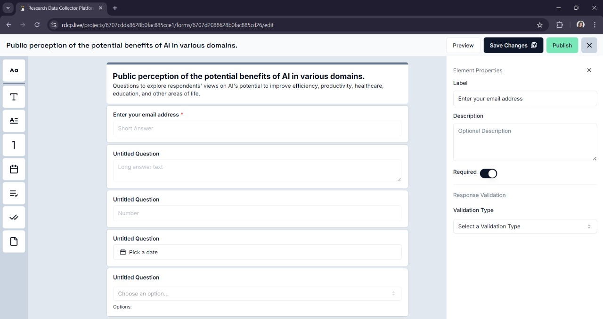

# Research Data Collector Platform

## Description

The Research Data Collector Platform is a comprehensive application designed for researchers to collect data from participants. It provides tools for creating surveys, distributing them, and analyzing the collected data. The platform consists of a backend API and a web frontend.




## Technologies Used

- **Backend**: NestJS, MongoDB, Redis, TypeScript
- **Web Frontend**: React, TypeScript, Tailwind CSS
- **Testing**: Jest for backend unit tests, Cypress for frontend end-to-end tests
- **Containerization**: Docker and Docker Compose for managing services


## Prerequisites

- **Node.js**: Ensure you have the Node v20 LTS version installed.
- **Yarn**: Used for dependency management.
- **Docker**: Required for containerizing the application.
- **Docker Compose**: Orchestrates multi-container Docker applications.

## Setup

### Backend

1. Clone the repository to your local machine.
2. Navigate to the `backend` directory.
3. Create a `.env` file in the `backend` directory. You can use the `.env.template` file as a template.
4. Install the required dependencies by running `yarn install`.
5. Start the database and Redis server by running `docker-compose up`.
6. Start the application in development watch mode by running `yarn start:dev`.

#### Running the Backend in Production Mode Locally

Run the following command to start the application in production mode:

```bash
$ docker compose -f compose.yml -f compose.app.yml up -d
```

### Web Frontend

1. Navigate to the `web` directory.
2. Create a `.env.development` file in the `web` directory. You can use the `.env.sample` file as a template.
3. Install the required dependencies by running `yarn`.
4. Start the application by running `yarn dev`.

**Note**: It is recommended to use Yarn as the package manager for this project. If you do not have Yarn installed, you can install it by running:

```bash
$ npm install --global yarn
```

If you accidentally use npm to install the dependencies, you may encounter issues when running the application. To fix this, delete the `node_modules` directory, `package-lock.json`, and run `yarn` to install the dependencies using Yarn.

## Testing

### Backend Testing

#### Unit Tests

The unit test files are named `*.spec.ts` and are located in the same directory as the service being tested. The tests are run using the `jest` testing framework.

```bash
$ yarn run test
```

#### End-to-End Tests

End-to-end tests validate the API endpoints. They use the `supertest` library to make requests to the API endpoints and check the responses. The tests are written in the `test/e2e` directory. An In-Memory MongoDB database is created and seeded with test users before the tests are run. The test database is destroyed after the tests are run.

```bash
$ yarn run test:e2e
```

#### Test Coverage

```bash
$ yarn run test:cov
```

### Web Frontend Testing

End-to-end tests for the web frontend are written using Cypress. To run the tests:

1. Start the application by running `yarn dev` in the `web` directory.
2. Run `yarn cypress open` in the `web` directory.
3. Click on the test file you want to run in the Cypress window that opens.
4. The test will run in a new browser window.