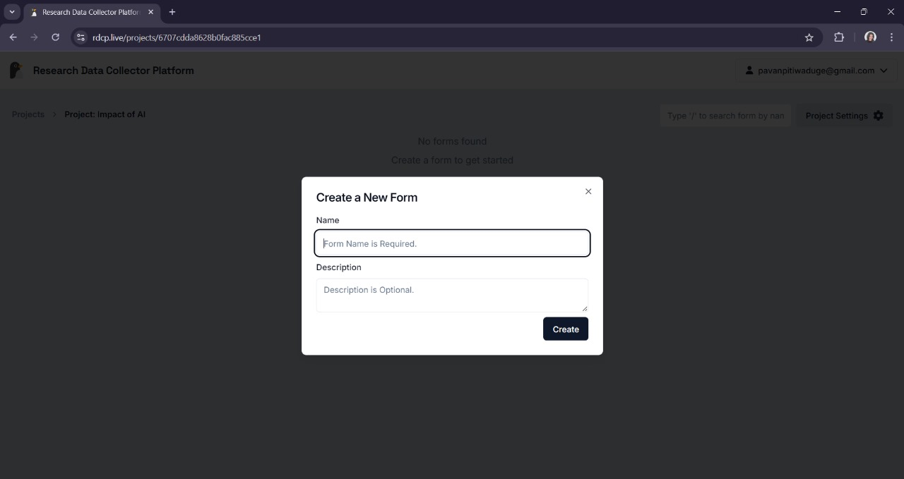
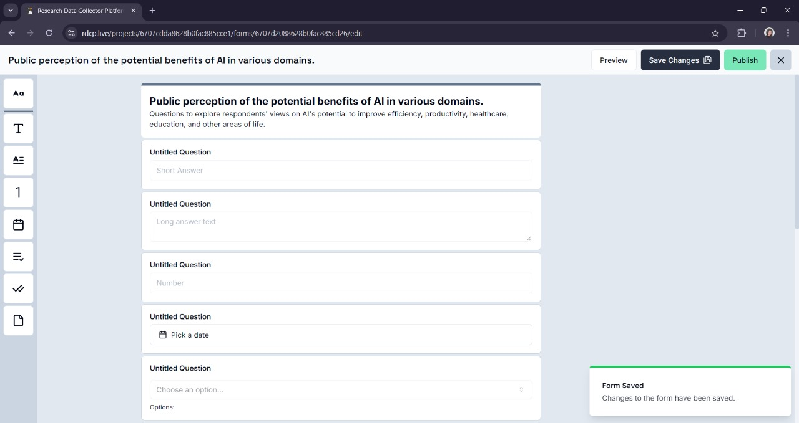
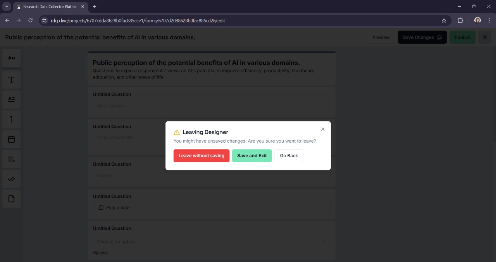

# Creating a New Form

## Accessing Forms

- Inside a project, navigate to the **Forms** section.
- Click on the **New Form** button to begin creating a new form for your data collection.

## Building Your Form

- Enter a **form name** and an optional **brief description**.

### Add Form Fields

- Use **drag-and-drop** or **predefined templates** to add various field types (e.g., text, numbers, images) to your form.
- Adjust field validation settings such as mandatory fields, field types, and format.

## Saving Your Form

- Once your form is built, click **Save Changes** to store it in the system for future data collection.

- Then, click the **X** button to exit the designer and select one of the available options of your preference.

