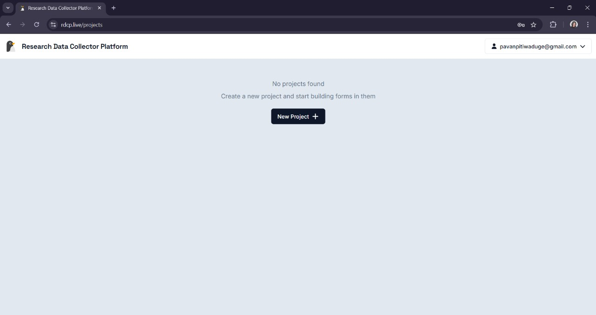
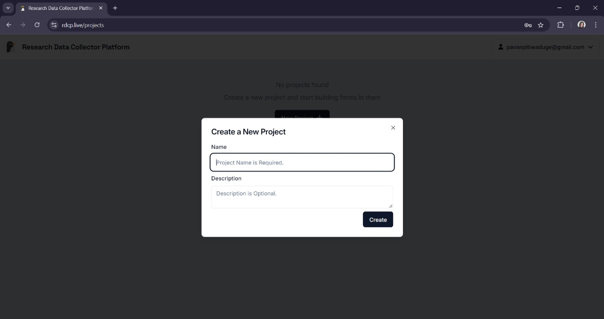
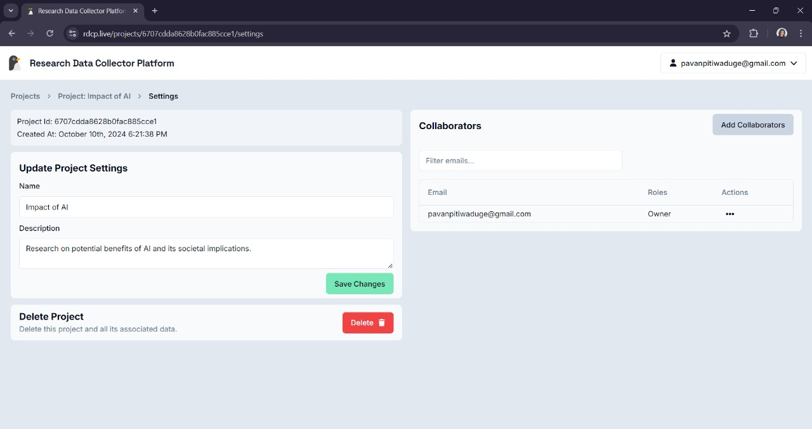
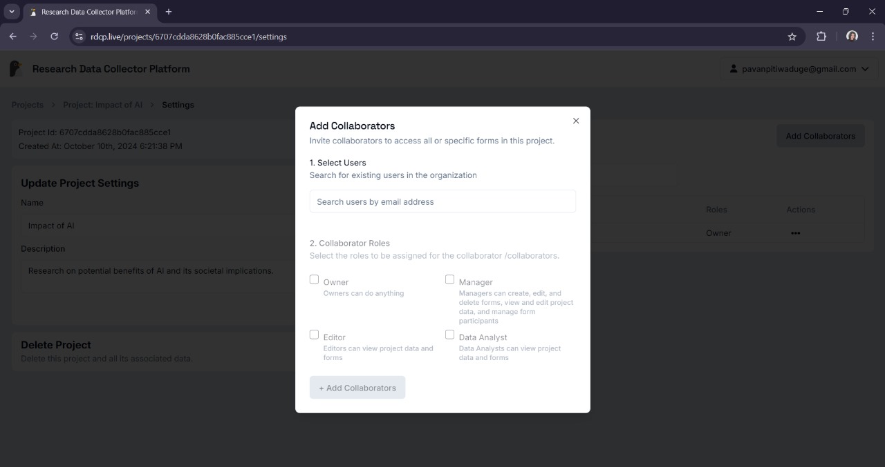

# Creating a New Project

## Accessing Projects

Once logged in, you will be taken to the **Projects** page.

- If you don't have any existing projects, you will seea message saying _"No projects found."_
- Click on the **New Project** button to start creatinga new project.

## Project Creation

In the **Create a New Project** popup:

- **Name**: Enter a name for your project (this is required).
- **Description**: Optionally, provide a brief description of the project.

Click the **Create** button to finalize the creation of the project.

## Adding Collaborators

After creating or accessing your project:

1. Click on the project's settings or options.
   
2. Click on the **Add Collaborators** button to add already registered users of the platform as your project collaborators.
   
3. To add collaborators:
   - Type the email of a registered user.
   - Assign them a role from the checkbox menu displayed.
   - Click **Add** to include them in your project.

Once you add collaborators, they will be listed in a table with their **email addresses** and **roles**, allowing you to:

- Update permissions.
- Remove members with ease.
