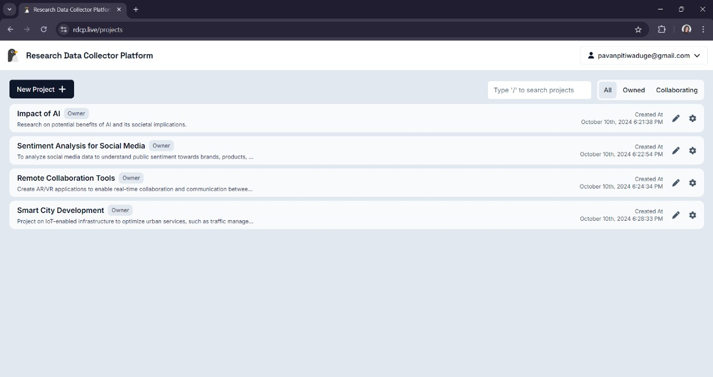
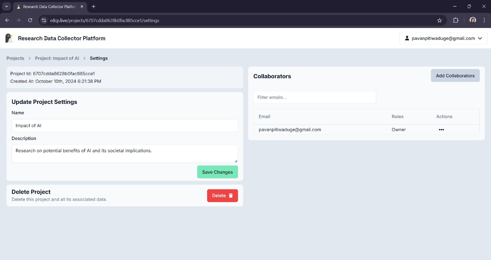

# Deleting a Project

## Accessing Your Projects

- After creating or accessing your project, Click on the project's settings or options menu (usually represented by **three dots** or a **gear icon** next to the project name).
- Choose **Delete Project** from the dropdown list.

## Confirming Deletion

- A confirmation popup will appear asking if you're sure about deleting the project.
- Click **Delete** to remove the project permanently from your account.
