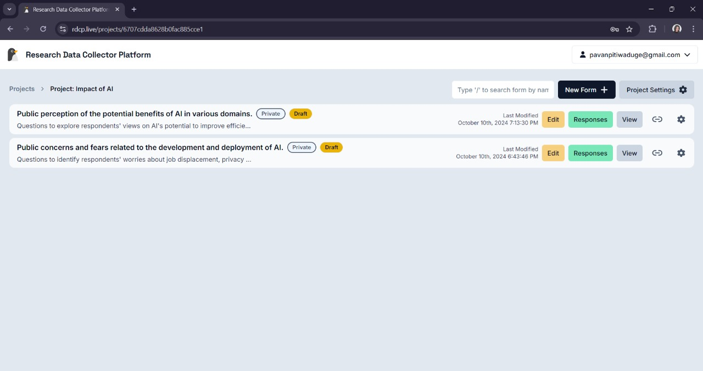
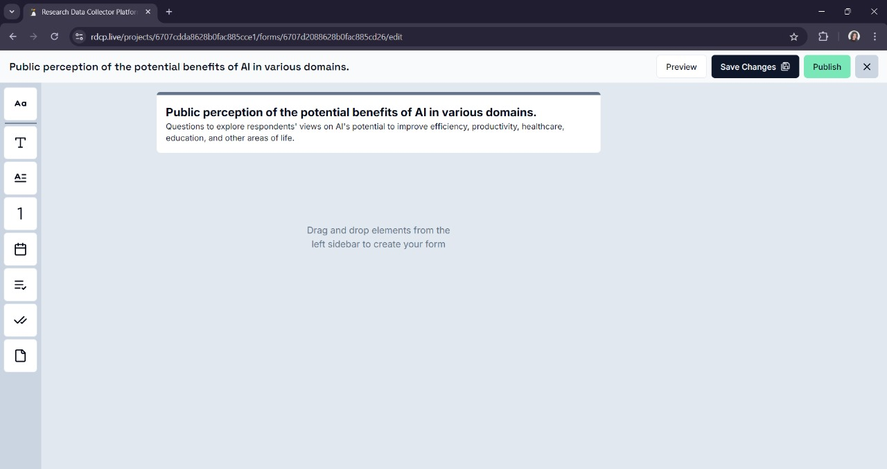
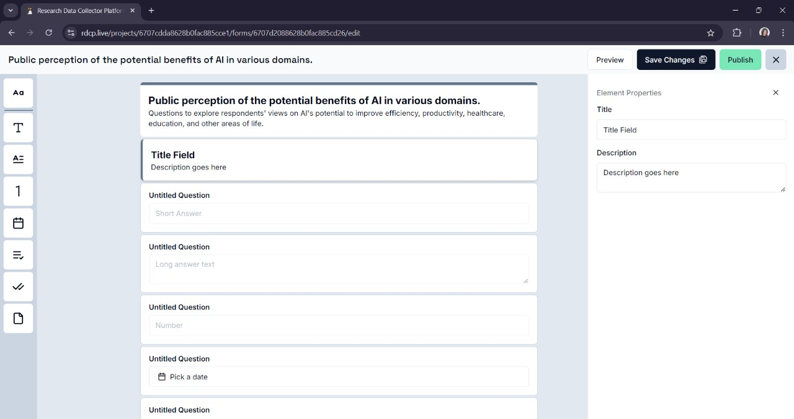

# Editing and Deleting Forms

## Editing a Form

- To edit an existing form, open the project where the form is stored, navigate to the **Forms** section, and select the form you want to edit.
- Click on **Edit** and modify any fields, settings, or layout as required.

## Using the Form Builder

- You can build your form by **dragging and dropping** elements from the left-hand sidebar to the droppable area in the middle.
- Once the elements are added to the droppable area, you can rearrange them as needed to structure your form.

## Editing Element Properties and Validations

- You can mark a question as required using the **toggle switch** in the properties panel.

- The system indicates required questions by displaying a **red asterisk** in the top right corner of the question.

### Available Form Elements

#### **Aa**: Title and Description Field

- Requires a title with at least 2 characters and a description with at least 5 characters.

#### **T**: Short Answer Field

- Requires a label where users can include survey questions for short answers.
- Description is optional.
- You can use response validation to:
  - Restrict the response length (min and max lengths).
  - Validate responses as phone numbers or emails.
- The system will display the applied validation under the form element.

#### **A≡**: Paragraph Field

- Similar to the short answer field but designed for longer responses.

#### **1**: Number Input

- Allows you to add validations for numerical responses.

#### **Calendar Icon**: Date Picker

- Allows respondents to pick a date as their response.

#### **Dropdown Icon**: Dropdown Field

- Lets you add dropdown options for respondents to select their answer from.

#### **Checkmark**: Checkbox Field

- Lets respondents select one or more options.

#### **Document Icon**: File Upload Field

- Allows file uploads with restrictions on file formats (e.g., PDFs, images, audio, video) and maximum file size.

## Deleting a Form

- Click on the **Delete** button if you wish to delete the form and all associated data.
- A confirmation prompt will appear asking if you're sure. Once confirmed, this action cannot be undone.
