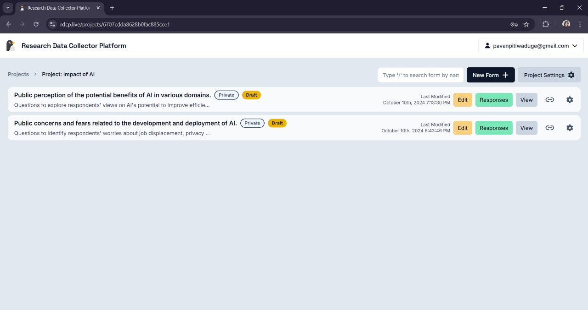

# Form Settings

## Locate the Form

- Navigate to the **Forms** section where the forms are listed.
- Select the form you wish to update by clicking on the **Settings Icon** in the actions bar.
- The **Form Settings** page will appear with options for editing and managing the form details.

## Update Form Settings

### Form Name

- You can change the name of the form by typing a new name into the **Name** field.
- The name should reflect the purpose of the survey to help users understand its focus.

### Description

- Update the **Description** field to provide an overview of the form's purpose.
- The description helps respondents understand the context of the form.

### Enable Public Survey

- Selecting this option will make the form accessible to everyone via a **public link**.
- When enabled, anyone with the link will be able to view and complete the form.

> **Note:** Public forms are ideal for broad surveys where responses from a general audience are required.

### Publish Form

- Clicking the **Publish** button will make the form live and available for responses.
- Once published, the form link can be shared with participants, and they can start submitting their responses.

### Multiple Responses

- If selected, users will be able to submit more than one response to the form.

> **Note:** This option is available only for **private forms**. For public forms, multiple responses are allowed automatically.

### Save Changes

- After making any updates, click on **Save Changes** to apply your modifications.
- Failing to save will result in losing any unsaved changes made to the form settings.
