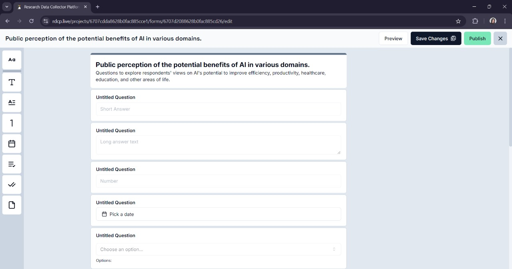
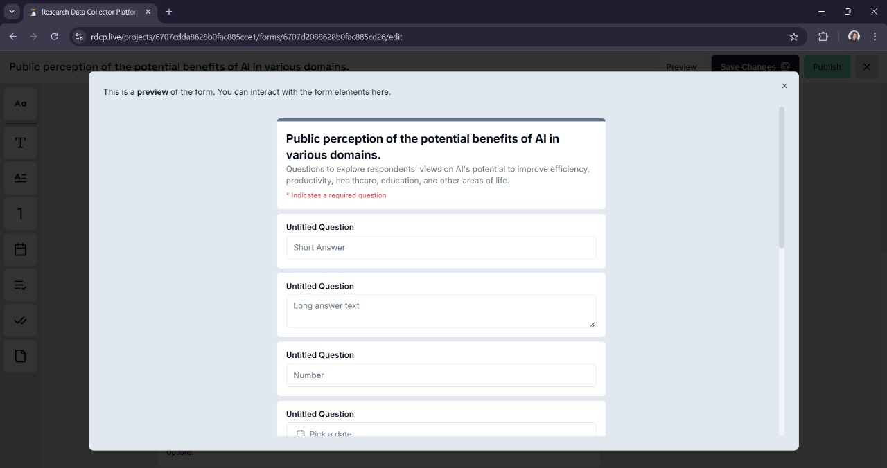
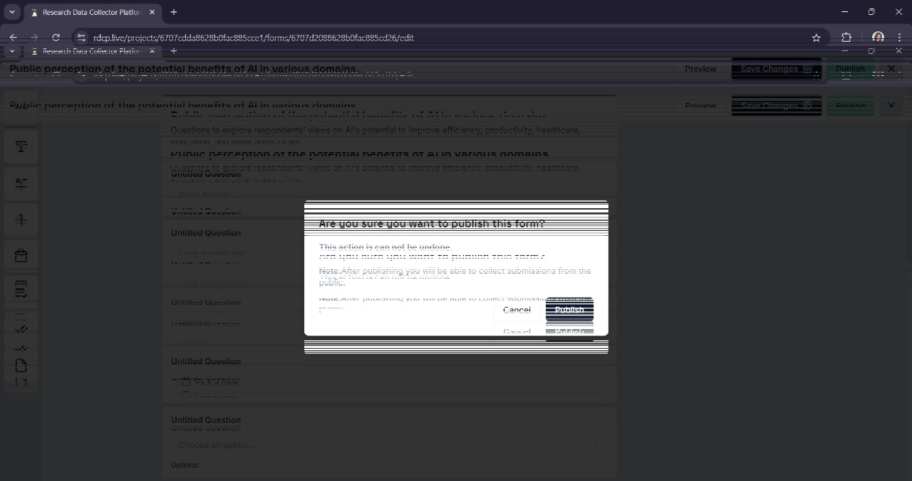

# Previewing and Publishing Forms

## Access the Form

- Inside a project, navigate to the **Forms** section, where all your forms are listed.
- Locate the form you want to preview and click on **Edit**.

## Previewing

- Click on the **Preview** button next to the form name in the form's actions menu.
- A new popup will display a live preview of the form as it will appear to users.

- This allows you to verify the form layout, input fields, and field validation settings.
- Interact with the form in preview mode by entering sample data to test the input fields and validation rules.

## Making Adjustments (if necessary)

- If you notice any issues during the preview, exit the preview mode by closing the window or clicking **X** in the top right corner.
- Return to the form editor and make any necessary changes.

## Saving Changes

- After making adjustments, save the changes and preview the form again to ensure everything is working as expected.

## Publishing the Form

- Click on the **Publish** button (usually located in the form's actions menu or next to the preview option).
- A popup or notification will appear, asking you to confirm the publication of the form. Confirm by clicking **Publish**.

