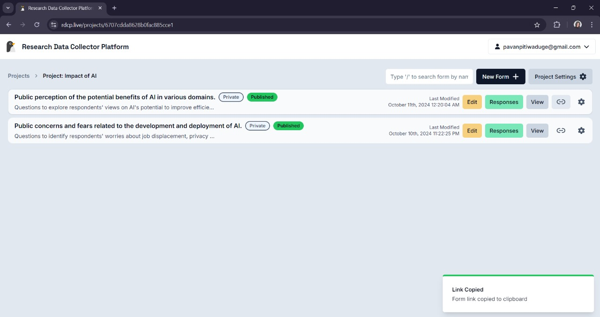

# Sharing a Form

- Once the form is **published**, it will be available for use in the data collection process.
- To share the form with participants, you can copy the URL link to the form.

## How to Share

- Navigate to the **Forms** section of the project.
- Locate the form you want to share and click on the **Copy link** icon in the action panel.
- The link will be copied to your clipboard, allowing you to share it with participants for data collection.

This link can be sent via email, messaging apps, or embedded in other digital platforms to reach your target audience.
