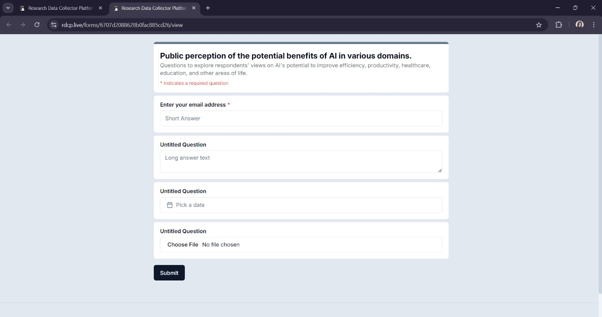
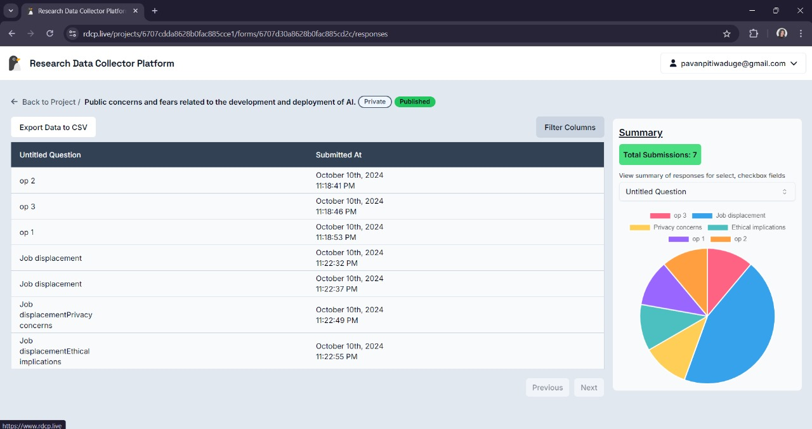

# Viewing a Form and Form Responses

## Viewing the Form

- Inside a project, navigate to the **Forms** section, where all your forms are listed.
- Locate the form you want to view and click on **View**.
- A new tab will open, displaying the form as it appears to users.

- You can interact with the form and submit responses if multiple submissions are allowed.

## Viewing Form Responses

- Inside a project, navigate to the **Forms** section, where all your forms are listed.
- Locate the form you want to preview and click on **Responses**.

### Response Table

- All the responses submitted by respondents will be visible in the **response table**.
- You can click on the **Filter Column** option to hide or show specific columns in the response table, making it easier to focus on relevant data.
- If you need to analyze the data in a spreadsheet, click the **Export Data to CSV** button to download a CSV file containing all the responses.
- If there are multiple pages of responses, use the **Previous** and **Next** buttons to navigate between them.

### Checkbox/Select Field Questions

- If the form includes checkbox or select field questions, you can choose a specific question from the drop-down menu to view its summary, including the number of responses for each option.

Example of a summary display:

